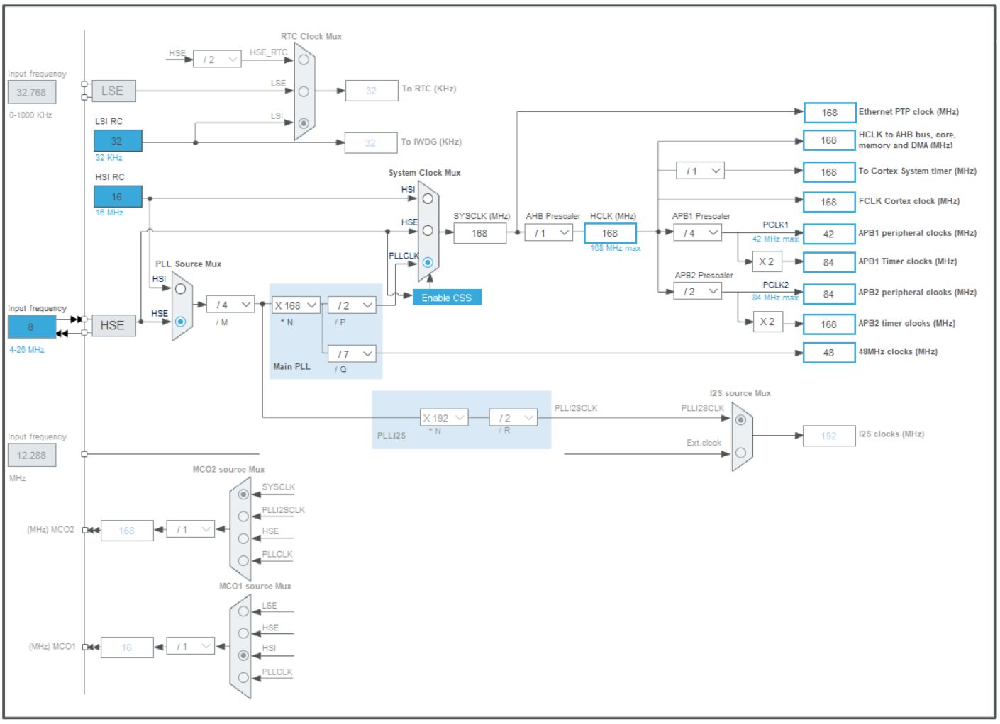
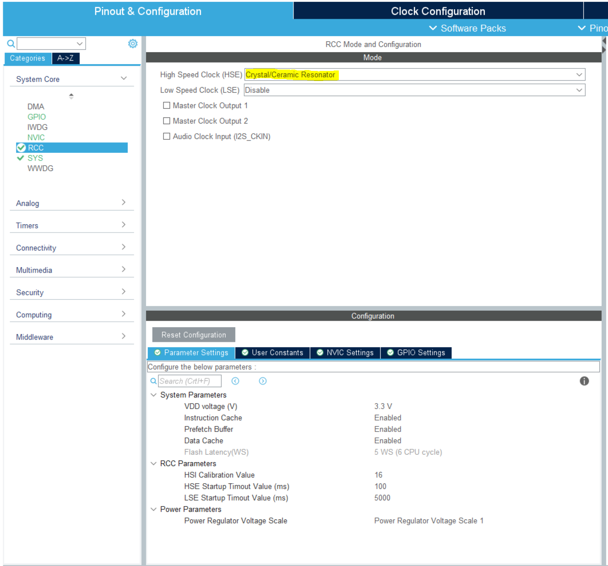
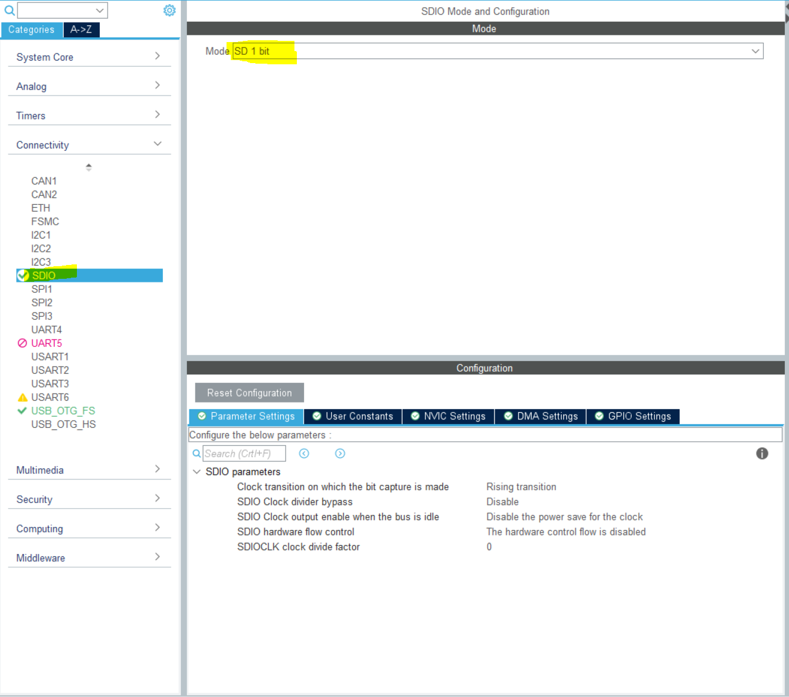
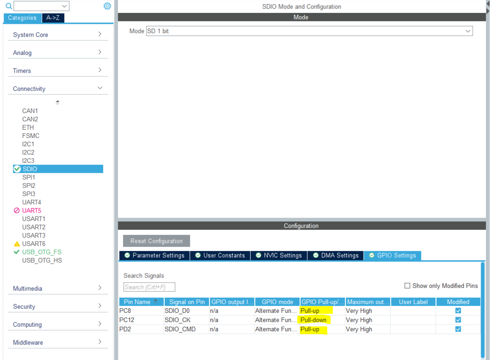
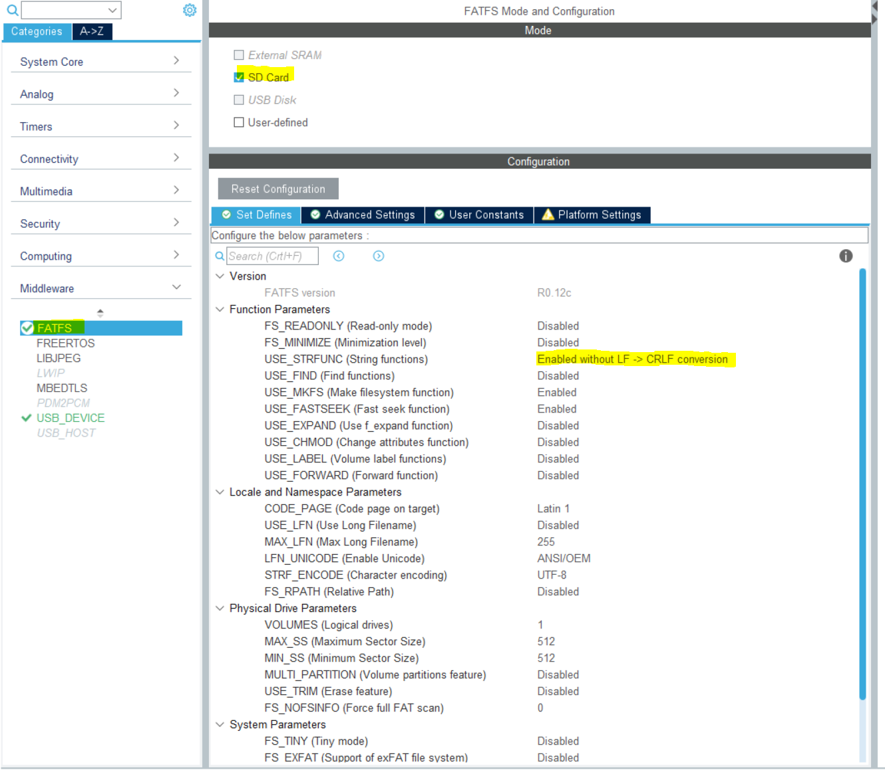
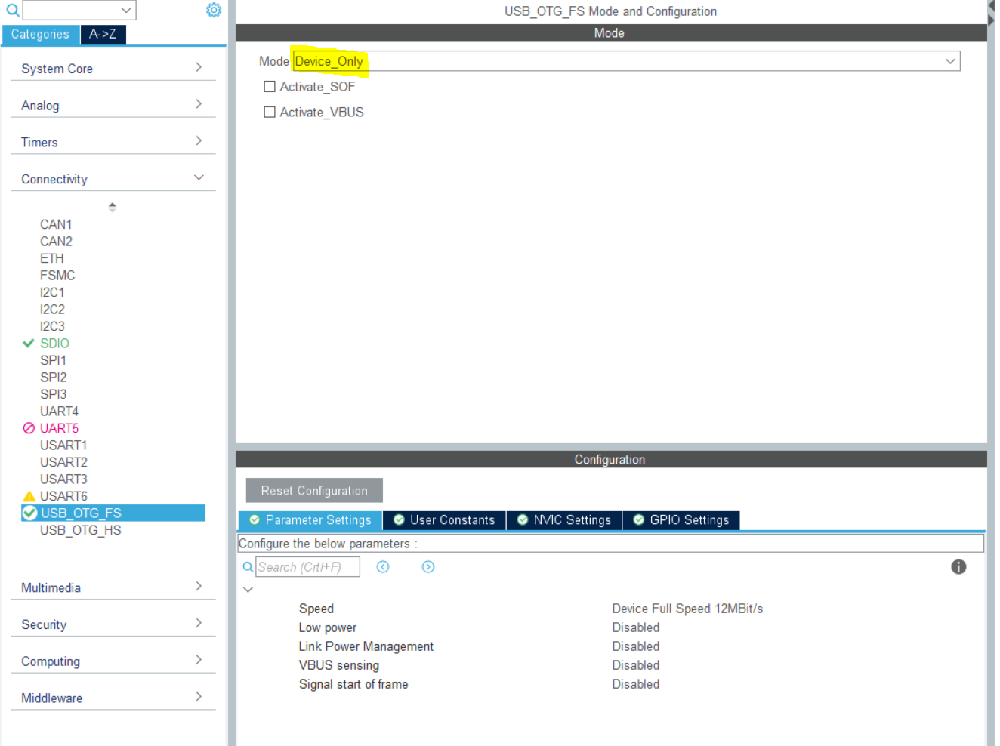
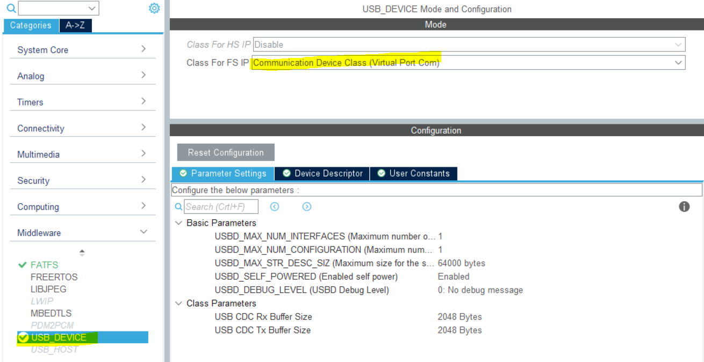

# STM32 + SDCard + Qt GUI

This is a simple project that involves STM32 microcontroller, FATFS and USB OTG.

### Motivation

I want to create a robot arm and to achieve this I am familiarizing myself with all the components that integrates it:

- An SDCard for logs, configurations and other information
- A GUI to visually control and monitor the robotic arm while performing a task
  - [Serial port and file generation](https://github.com/Vlixes95/Qt-Serial-Port) on the micro SD card
  - [Serial port with IMU](https://github.com/Vlixes95/QT_GUI_IMU) and 3d model
- RTOS for better performance
- LCD and buttons to configure and control the robot arm without a pc
- IMU & encoders to receive feedback from the stepper motors
- Stepper motors & drive to control the movement of the robot arm
- Camera and object recognition to guide the robot arm

In this project I'm developing the part where the robot arm will generate logs and configuration files.

## GOAL

The goal of this project is to communicate a STM32 microcontroller with a GUI via USB connection and create files in a microSD card.

Error handling and performance improvements will be done when integrating all components, this project is just an introduction.

## Hardware

- [STM32F407VG](https://stm32-base.org/boards/STM32F407VGT6-STM32F4XX-M) with SDCard socket on it.
- Micro SDCard

## Software and IDE

- Clion (usually I use STM32CubeIDE but I wanted to try Clion)

## Libraries

- [FatFS](http://elm-chan.org/fsw/ff/00index_e.html) - Generic FAT Filesystem Module for small embedded systems..

## Custom Libraries

- In order to build messages to exchange data between the devices, I include a custom data packaging that is getting updated in every project where I use it (knowing there are better options out there or JSON libraries).

## STM32CubeMX Configuration

- Clock Configuration

  

- RCC

  

- SDIO

  

  

- FATFS
  

- USB
  

- USB DEVICE
  

## References

- SDCard Example: http://stm32f4-discovery.net/2014/07/library-21-read-sd-card-fatfs-stm32f4xx-devices/
- USB Example: http://stm32f4-discovery.net/2014/08 library-29-usb-msc-host-usb-flash-drive-stm32f4xx-devices/
- Message Packing: https://msgpack.org
